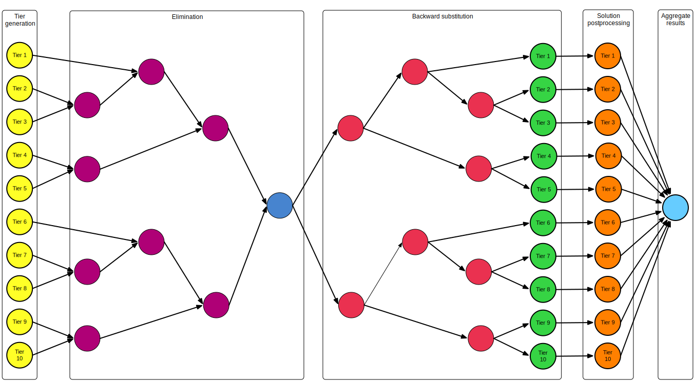

# MES workflow sovler

The algorithm is described in [1] and [2]. The general idea is to divide h-adapted mesh into slices called here tiers that can be naturally mapped into fronts of multifrontal solver. For some generic meshes (e.g. point (corner) 2D or 3D [2]) tiers may generated when doing adaptation.

## Input parameters for Point (corner) 2D singularity

* $N_{tiers}$ – Number of tiers
* $p$ – Polynomial degree (now fixed to 2)
* $a1Size = 3(p-1)^2 + 10(p-1) + 8$ – fixed to 21
* $leafSize = 3(p-1)^2 + 8(p-1) + 6$ – fixed to 17
* $aNSize = 3(p-1)^2 + 10(p-1) + 8$ – fixed to 21
* $interfaceSize = 2(p-1) + 3$ – fixed to 5
* Domain size and position
* Test function

## Common operations

### Matrices adding

Elimination nodes receive two matrices from previous tasks. They are added with overlap (see „equation”), so that the interfaces of summed tiers that is in the middle is fully assembled and may be eliminated.

$$\left\(
\begin{bmatrix}
A & B \\\\\
C & D
\end{bmatrix}, \begin{bmatrix} 
E \\\\\ 
F\end{bmatrix}\right\)
⨁
\left\(
\begin{bmatrix}
G & H \\\\\
I & J
\end{bmatrix}, \begin{bmatrix} 
K \\\\\ 
L\end{bmatrix}\right\) =
\left\(\begin{bmatrix}
A & B & 0 \\\\\
C & D+G & H \\\\\
0 & I & J
\end{bmatrix}, \begin{bmatrix} 
E \\\\\ 
F+K \\\\\ 
L
\end{bmatrix}\right\)
$$

### Interior elimination

Initially interface 1 is at the begining of the matrix and interface 2 is at the end of the matrix. What we want is to move fully assembled rows (interior of the tier) to beginning of the matrix by swapping rows and columns as presented in the equation. Then we eliminate variables of fully assembled rows as in elimination phase.

$$\left\(
\begin{bmatrix}
A & B & C \\\\\
D & E & F \\\\\
G & H & I
\end{bmatrix}, 
\begin{bmatrix} 
K \\\\\ 
L \\\\\ 
M
\end{bmatrix}\right\) ⇒ \left\(\begin{bmatrix}
E & D & F \\\\\
B & A & C \\\\\
H & G & I
\end{bmatrix},
\begin{bmatrix} 
L \\\\\ 
K \\\\\ 
M
\end{bmatrix}\right\) ⇒ \left\(\begin{bmatrix}
𝐈 & D' & F' \\\\\
0 & A' & C' \\\\\
0 & G' & I'
\end{bmatrix}, 
\begin{bmatrix} 
L' \\\\\ 
K' \\\\\ 
M'
\end{bmatrix}\right\)$$

The submatrix $\left\(\begin{bmatrix}
A' & C' \\\\\
G' & I'
\end{bmatrix},
\begin{bmatrix} 
K' \\\\\ 
M'
\end{bmatrix}\right\)$ is then subject to further elimination while  $\left\(\begin{bmatrix}
D' & F' 
\end{bmatrix}, 
\begin{bmatrix} 
L'
\end{bmatrix}\right\)$ is stored for use in backsubstitution phase.

## Components

### Workflow generator

Given $N_{tiers}$ tiers we construct binary elimination tree with leaf for each tier. The tree needs to be traversed up in order to eliminate rows, down to do backward substitution. Then results may be aggregated and postprocessed. This gives 

### Input matrix generator

Generates matrices for tiers. The nodes are numbered so that at the begining there is outside interface, then interior follows, ending with inside interface. This is always true, also for edge cases.

### Data preprocessing – productions A1, A, AN

The idea of preprocessing is to transform matrices in such way that they follow the same scheme as matrices in elimination phase.

#### First tier (A1)

The matrix does not require row/column reordering — the inside interface is where it should be. The last $a1Size - 2 \cdot interfaceSize$ rows are eliminated and the rest ($2 \cdot interfaceSize$ rows) is saved as usual for elimination.

#### Intermediate tiers (general case)

Does *Interior elimination*.

#### Last tier (AN)

The outside interface is at the begining of the matrix while additional nodes are at the end. The rows and columns are reordered, so that $2 \cdot interfaceSize$ rows/columns from the begining of the matrix are moved to the end of it. In the result outside interface is where it should be. The last $aNSize - 2 \cdot interfaceSize$ rows are eliminated and the rest ($2 \cdot interfaceSize$ rows) is saved as usual for elimination.

### Elimination (traversing up) – production A2Node

Does *Matrices adding* then *Interior elimination* steps.

### Root solving – production A2Root

Does *Matrices adding* then the resulting equation system is solved resulting with RHS $\begin{bmatrix}A &  B & C\end{bmatrix}^T$. The $\begin{bmatrix}B &  A\end{bmatrix}^T$ is RHS of left children interface rows while $\begin{bmatrix}A &  C\end{bmatrix}^T$ is RHS of right children interface rows.

### Backward substitution (traversing down) – production B2

Inputs are matrix saved by coresponding elimination node: $\left\(\begin{bmatrix}
D' & F' 
\end{bmatrix}, 
\begin{bmatrix} 
L'
\end{bmatrix}\right\)$ and RHS of interface nodes saved by parent node (B2 or root): $\begin{bmatrix}M &  N\end{bmatrix}^T$. So we construct equation system 
$$ 
\begin{bmatrix}
𝐈 & D' & F' \\\\\
0 & 𝐈 & 0 \\\\\
0 & 0 & 𝐈
\end{bmatrix}
\begin{bmatrix}A \\\\\ B \\\\\ C\end{bmatrix} = \begin{bmatrix}L' \\\\\  M \\\\\ N\end{bmatrix}^T
$$

When solved, the $\begin{bmatrix}B &  A\end{bmatrix}^T$ is RHS of left children interface rows while $\begin{bmatrix}A &  C\end{bmatrix}^T$ is RHS of right children interface rows. The data is propagated down the elimination tree.

### Results postprocessing

Resulting rows need to be reordered to revert preprocessing stage. 

#### First tier (A1)

Does not need any postprocessing.

#### Intermediate tiers (general case)

TODO (kolejnosc wypisywania: 2 1 3)

#### Last tier (AN)

The last $2 \cdot interfaceSize$ rows are moved to the front of the result vector.

### Results aggregation and rendering

## References

1. P. Obrok, P. Pierzchała, A. Szymczak, and M. Paszyński, “Graph grammar-based multi-thread multi-frontal parallel solver with trace theory-based scheduler,” Procedia Comput. Sci., vol. 1, no. 1, pp. 1993–2001, May 2010.
1. D. Goik, K. Jopek, M. Paszyński, A. Lenharth, D. Nguyen, and K. Pingali, “Graph Grammar based Multi-thread Multi-frontal Direct Solver with Galois Scheduler,” Procedia Comput. Sci., vol. 29, pp. 960–969, 2014.

